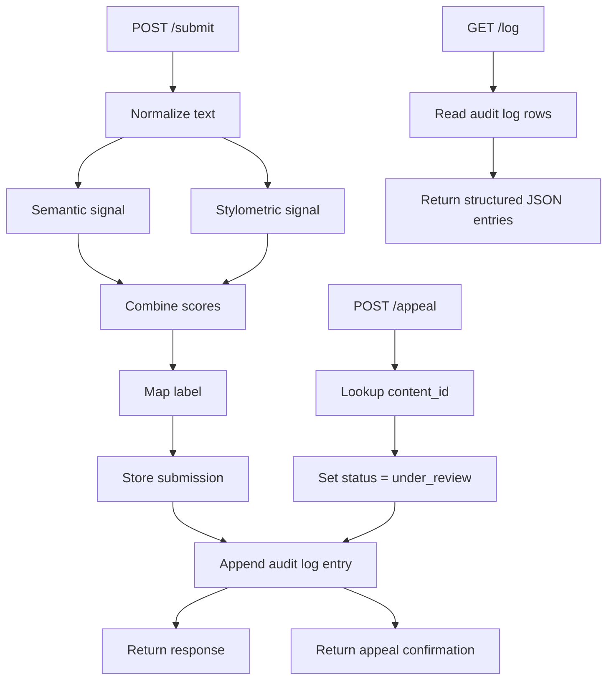

# Provenance Guard — Planning

## Goal

Build a Flask service that accepts submitted creative text, classifies it as more likely to be human-authored or AI-generated, returns a confidence score and a reader-facing transparency label, logs every decision, and supports creator appeals.

## Detection Signals

1. Semantic LLM-style signal
   - What it measures: whether the text reads as coherent, polished, and stylistically machine-like or as personal, messy, and human-written.
   - Output: a score from 0.0 to 1.0 where higher values mean more AI-like.
   - Strength: captures tone, coherence, and broad semantic patterning.
   - Blind spot: it can over-interpret formal writing as AI-like and may miss very short or highly edited text.

2. Stylometric heuristic signal
   - What it measures: sentence-length regularity, punctuation density, lexical diversity, and the presence of casual markers such as contractions or first-person language.
   - Output: a score from 0.0 to 1.0 where higher values mean more AI-like.
   - Strength: captures structural regularity that is often visible even when semantics are ambiguous.
   - Blind spot: informal but genuinely human text can look AI-like if it is unusually polished, and vice versa.

## Uncertainty Representation

The system uses a combined confidence score from both signals. The raw score is the weighted average:

$$
confidence = 0.6 \times semantic\_score + 0.4 \times stylometric\_score
$$

The resulting score is mapped into three categories:

- $confidence \ge 0.65$: high-confidence AI
- $confidence \le 0.35$: high-confidence human
- otherwise: uncertain

This is intentionally conservative because a false positive (marking a human creator as AI) is worse on a sharing platform than a false negative.

## Transparency Label Variants

The user-facing label text is:

- High-confidence AI: "High confidence this content appears to have been generated by AI."
- High-confidence human: "High confidence this content appears to have been created by a human."
- Uncertain: "Uncertain origin: this content could be AI-generated or human-authored."

## Appeals Workflow

Any creator who submitted content can file an appeal by sending a content_id and creator_reasoning. The request updates the submission status to "under_review" and appends a structured audit entry with the original classification plus the appeal reasoning. A reviewer can inspect the content record and the audit log to decide whether the case needs manual follow-up.

## Anticipated Edge Cases

1. A short poem with repetition and simple vocabulary may be misread by the heuristics as AI-generated because the structure is unusually regular.
2. A polished, formal human essay may produce a high AI-like score due to long sentences and low casual markers even though it is clearly authored by a person.
3. A heavily edited AI draft may look human enough that the two signals disagree and land in the uncertain band.

## Architecture

```text
POST /submit
  -> normalize text
  -> semantic signal (Groq or fallback proxy)
  -> stylometric signal
  -> combine scores into confidence
  -> map to transparency label
  -> store submission row
  -> append audit log entry
  -> return content_id, attribution, confidence, label

POST /appeal
  -> look up content_id
  -> update status to under_review
  -> append appeal audit log entry
  -> return confirmation

GET /log
  -> read audit log rows
  -> return structured JSON entries
```



The submission flow produces both the user-facing decision and a permanent record. The appeal flow reuses the same storage so a human reviewer can see the original classification, the creator's reasoning, and the status change in one place.

## Stretch Feature: Analytics Dashboard

The repository also includes a lightweight analytics dashboard endpoint at GET /analytics. It reports the overall distribution of verdicts (AI vs human vs uncertain), the appeal rate, and the average confidence score across submissions.

## AI Tool Plan

### Milestone 3: submission endpoint + first signal
- Provide the detection signals section and the architecture diagram to the AI tool.
- Ask it to generate the Flask app skeleton and the first signal stub.
- Verify by calling /submit directly and checking that the response includes content_id, attribution, confidence, and label.

### Milestone 4: second signal + confidence scoring
- Provide the detection signals section, the uncertainty section, and the architecture diagram.
- Ask it to generate the second signal and the weighted scoring logic.
- Verify by submitting clearly AI-like, clearly human-like, and borderline text and checking that confidence and labels move meaningfully.

### Milestone 5: production layer
- Provide the label variants, appeals workflow, and architecture diagram.
- Ask it to generate the label mapping logic, /appeal route, logging, and rate limiting.
- Verify by submitting content, filing an appeal, checking /log, and confirming that rate limits produce 429 responses after the threshold is exceeded.
